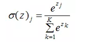

# 前言

yolo各个版本的创新点介绍：

1.https://blog.csdn.net/lemonbit/article/details/109281590?utm_medium=distribute.pc_relevant.none-task-blog-2~default~baidujs_baidulandingword~default-0.pc_relevant_default&spm=1001.2101.3001.4242.1&utm_relevant_index=3


2.https://blog.csdn.net/qq_40716944/article/details/114822515?spm=1001.2101.3001.6650.10&utm_medium=distribute.pc_relevant.none-task-blog-2~default~CTRLIST~Rate-10.pc_relevant_default&depth_1-utm_source=distribute.pc_relevant.none-task-blog-2~default~CTRLIST~Rate-10.pc_relevant_default&utm_relevant_index=13

# 第一章 yolo理论知识

## 1.1 Batch Normalization（批量归一化）

yolov2中引入BN层。

### 1.1.1mini-batch SGD(小批量随机梯度下降)的由来

1.神经网络的步骤是：

​	1).前向计算得到预测值y;

​	2).预测值和真实值最小二乘得到loss;

​	3).loss向后求导得到 dx;

​	4).x = x - dx 各个层返向传播更新参数;

​	5).loss最小时停止迭代。

2.关于loss的选取：

​	1).梯度下降法：计算所有训练样本的loss作为总的loss。每进行一次 迭代 都需要将所有的样本进行计算，当样本量十分大的时候，会非常消耗计算资源，收敛速度会很慢。

​	2).SGD(随机梯度下降法)：每一次迭代只计算一个样本的loss呢？然后再逐渐遍历所有的样本，完成一轮(epoch)的计算。过于自由导致训练的loss波动很大。

​	3).mini-batch SGD(小批量随机梯度下降)：每次只拿总训练集的一小部分来训练，比如一共有5000个样本，每次拿100个样本来计算loss，更新参数。50次后完成整个样本集的训练，为一轮（epoch）。由于每次更新用了多个样本来计算loss，就使得loss的计算和参数的更新更加具有代表性。


BN正是针对mini-batch SGD的一种让每个隐层节点的激活输入分布固定下来的方法。

### 1.1.2 BatchNorm的本质思想

​		BN的基本思想其实相当直观：因为深层神经网络在做非线性变换前的激活输入值（就是那个x=WU+B，U是输入）随着网络深度加深或者在训练过程中，其分布逐渐发生偏移或者变动，之所以训练收敛慢，一般是整体分布逐渐往非线性函数的取值区间的上下限两端靠近（对于Sigmoid函数来说，意味着激活输入值WU+B是大的负值或正值），所以这导致反向传播时低层神经网络的梯度消失，这是训练深层神经网络收敛越来越慢的本质原因，而BN就是通过一定的规范化手段，把每层神经网络任意神经元这个输入值的分布强行拉回到均值为0方差为1的标准正态分布，其实就是把越来越偏的分布强制拉回比较标准的分布，这样使得激活输入值落在非线性函数对输入比较敏感的区域，这样输入的小变化就会导致损失函数较大的变化，意思是这样让梯度变大，避免梯度消失问题产生，而且梯度变大意味着学习收敛速度快，能大大加快训练速度。

常见的标准化方法如下：

1)min-max标准化：


2)Z-score标准化：


### 1.1.3训练阶段如何做BatchNorm

​	具体在Mini-Batch SGD下做BN怎么做？


BN其具体操作流程，如论文中描述的一样：


​		经过这个变换后某个神经元的激活x形成了均值为0，方差为1的正态分布，目的是把值往后续要进行的非线性变换的线性区拉动，增大导数值，增强反向传播信息流动性，加快训练收敛速度。但是这样会导致网络表达能力下降，为了防止这一点，每个神经元增加两个调节参数（scale和shift），这两个参数是通过训练来学习到的，用来对变换后的激活反变换，使得网络表达能力增强。


## 1.2 anchor boxes(先验框)

​		在yolov1中只是通过回归直接预测出bounding box的坐标值，YOLO2采用先验框（anchor）。在每个grid预先设定一组不同大小和宽高比的边框，来覆盖整个图像的不同位置和多种尺度。

​		yolo将神经网络输出中的5个位置信息(预测框)当作和对应anchor的偏移量和尺寸放缩作为predict，将真实框和anchor的偏移量和尺寸放缩作为label。在损失函数中回归使得predict靠近label，从而使得预测框靠近真实框。

### 1.2.1anchor boxes的工作方式

​		在每个grid中设置3个具有代表性的框作为先验框，利用真实框(Ground Truth)和先验框的偏移和缩放比，将先验框回归得到预测框(Bounding Box)。

​		anchor box的作用是作为参考基准，以它为起点放缩平移得到预测框，它的整体位置和中心点是不变的。

https://blog.csdn.net/shenkunchang1877/article/details/105648111?utm_medium=distribute.pc_aggpage_search_result.none-task-blog-2~aggregatepage~first_rank_ecpm_v1~rank_v31_ecpm-15-105648111.pc_agg_new_rank&utm_term=anchorbox&spm=1000.2123.3001.4430

### 1.2.2 anchor boxes如何设置

​	1.手工指定anchor box形状；

​	2.对训练集中标注的边框进行K-mean聚类分析，以寻找尽可能匹配样本的边框尺寸。

## 1.3 logistic回归和softmax回归

  logistic函数常用作二分类场景中，表示输入已知的情况下，输出为1的概率：


softmax函数经常用在神经网络的最后一层，作为输出层，进行多分类：




☆☆对于输入x , logistic能做的是给出x是类A的概率；softmax能做的是给出x在所有可能性中是类A的概率。


logistic回归是二分类，通过“1对1“分类器和”1对其他“分类器转化为多分类；对于选择softmax分类器还是个logistic分类器，取决于所有类别之间是否互斥。所有类别之间明显互斥用softmax分类器，所有类别之间不互斥有交叉的情况下最好用个logistic分类器。

## 1.4 bottleneck模块

bottleneck:瓶颈层，在深层网络中用于减少参数量和计算量。方法是通过两个1X1fliter分别用于降低和升高特征维度，且在降维之后可以更加有效、直观地进行数据的训练和特征提取，对比如下图所示。


## 1.5性能指标mAP

​		在目标检测中性能指标主要由两部分组成：分类部分和预测框标定部分。

### 1.5.1分类部分

1.对于分类任务中的一个类A：

​	1)Precision(查准率)：TP / (TP + FP)在检测出的正样本中，有多大比例是真正的正样本

​	2)Recall(查全率)：TP / (TP + FN)在所有的正样本中，有多少被检测出来

​		根据计算时选取样本数的不同，Precision和Recall是呈现负相关的关系的。例如取出所有样本，那肯定正样本都包住了，recall=1，但是此时precision就很小了，因为我全部认为他们是正样本。

​	3)AP的计算：

​		根据输入样本绘制P-R曲线：


​		2010年之前计算方法。首先设定一组recall的阈值，[0, 0.1, 0.2, …, 1]。然后对于recall大于每一个阈值（比如recall>0.3），我们都会得到一个对应的最大precision。这样，我们就计算出了11个precision。AP即为这11个precision的平均值。这种方法英文叫做11-point interpolated average precision。

​		2010年后就换了另一种计算方法。新的计算方法假设这N个样本中有M个正例，那么我们会得到M个recall值（1/M, 2/M, ..., M/M）,对于每个recall值r，我们可以计算出对应（r' >= r）的最大precision，然后对这M个precision值取平均即得到最后的AP值。**(即recall根据实际情况划分阈值)**


2.mAP：分类任务中所有类别AP的平均值。

### 1.5.2预测框部分


## 1.6NMS非极大值抑制

### 1.6.1NMS解决的问题

问题：

（1）如果物体很大，而网格又很小，一个物体可能会被多个网格识别？

（2）如何判断出这几个网格识别的是同一个物体，而不是同一类的多个物体？

方案：

​		首先解决不同类的区分，YOLO将图片分割成s^2个网格。每个网格的大小相同，并且让s^2个网格每个都可以预测出B个边界箱（预测框）。预测出来的每个边界箱都有5个信息量: 物体的中心位置(x,y)，物体的高h，物体的宽w以及这次预测的置信度（预测这个网格里是否有目标的置信度）。每个网格不仅只预测B个边界箱，还预测这个网格是什么类别。假设我们要预测C类物体，则有C个置信度（预测是某一类目标的置信度），不同的类通过不同的置信度区分开。
​		其次解决(1)、(2)问题，把置信度（预测这个网格里是否有目标的置信度）最高的那个网格的边界箱作为极大边界箱，计算极大边界箱和其他几个网格的边界箱的IOU，如果超过一个阈值，例如0.5，就认为这两个网格实际上预测的是同一个物体，就把其中置信度比较小的删除。

## 1.7小目标的检测

### 1.7.1目标大小、感受野、特征图大小的关系

1.感受野：特征图上一个像素点在输入图片上映射的区域的大小，即特征图上的一个点对应输入图上的区域，特征图越小感受野越大。

2.特征图越小，其感受野越大，即代表原图中的映射区域更大，即在目标检测中可以检测到图像中较大的目标，而更容易忽略输入图像中的小目标，即大的映射区域缺失细节使得小目标更不易被检测。

### 1.7.2分类 和 检测 对感受野的要求

1.目标检测的两个子任务：分类和边框回归。

​		根据CNN的结构特点，越深的层得到的特征越抽象(高级)，越浅的层特征越细节(低级)，深层的特征已经丢掉了很多位置信息。浅层的小感受野也十分有利于小目标的检测。

​			1)分类任务：要求有较多的抽象特征；(要深层)

​			2)回归任务：要求有更多细节信息(位置信息等)；(要浅层)

​			3)小目标：需要大的特征图；(要浅层)


2.解决方案：特征融合(Neck层)

## 1.8框形成相关过程

### 1.8.1对于样本真实框的处理

1.根据目标和三个特征图中的anchor框对比，筛选条件是比较GT和各个anchor的宽比和高比，大于一定的阈值就是负样本，反之正样本。将图片上所有目标按其大小分发给三个不同大小的特征图，对某个特征图来说这个目标是正样本，则由这个特征图负责去检测。同时记录对于这个特征图上的哪一个anchor来说是正样本。

2.先假设所有的target对三个anchor都是正样本(复制三份) 再进行筛选  并将ai加进去标记当前是哪个anchor的target。

3.扩展正样本：因为预测框预测到target有可能不止当前的格子预测到了，可能周围的格子也预测到了高质量的样本，也要把这部分的预测信息加入正样本中。

## 1.9fine-tuning 和 multi-scale

### 1.9.1 multi-scale traing

多尺度训练对全卷积网络有效，一般设置几种不同尺度的图片，训练时每隔一定iterations随机选取一种尺度训练。这样训练出来的模型鲁棒性强，其可以接受任意大小的图片作为输入，使用尺度小的图片测试速度会快些，但准确度低，用尺度大的图片测试速度慢，但是准确度高。训练时，预先定义几个固定的尺度，每个epoch随机选择一个尺度进行训练（实际中还是单个尺度的训练）。

### 1.9.2 fine-turning

在实践中，由于数据集不够大，很少有人从头开始训练网络。常见的做法是使用预训练的网络（例如在ImageNet上训练的分类1000类的网络）来重新fine-tuning（也叫微调），或者当做特征提取器。

学习率：与重新训练相比，fine-tune要使用更小的学习率。因为训练好的网络模型权重已经平滑，我们不希望太快扭曲（distort）它们（尤其是当随机初始化线性分类器来分类预训练模型提取的特征时）。


## 1.10 ★★ 特征图大小和卷积核的关系

Conv(c1, c2, kernal_size, stride, padding )对于输入大小为n*n通道数为c1的特征图，经过卷积后，有：m = ((n + 2*p - k) / s) + 1，输出特征图为m*m通道数为c2。

注意：当s = 1,2p = (k - 1)时，特征图大小不变。

# 第二章 轻量化方向

## 2.1MobileNet网络

​		MobileNet在bottleneck结构中大量使用了深度可分离卷积。

​		深度可分离卷积（Depthwise Separable Convolution）是一种卷积结构。它是由一层深度卷积（Depthwise convolution）与一层逐点卷积（Pointwise Convolution）组合而成的，每一层卷积之后都紧跟着批规范化和ReLU激活函数。跟标准卷积的区别就是精度基本不变的情况下，参数与计算量都明显减少。


### 2.1.1深度卷积（Depthwise convolution）

​		传统卷积操作的卷积核通道数和输入的通道数相同，每个通道单独做卷积运算后相加，卷积核的个数决定输出的通道数。

​		深度卷积中一个卷积核只有一维，负责一个通道，一个通道只被一个卷积核卷积。


​		深度卷积输出的通道数和输入相同，无法扩展通道数，需要逐点卷积来生成特征图。

### 2.1.2逐点卷积（Pointwise Convolution）

​		本质就是卷积核为1的常规卷积。


## 2.2yolov4-tiny

YOLOv4-tiny 较 YOLOv4 少了一个 52×52 的尺度输出，输出的特征层从三尺度变为双尺度。

## 2.3剪枝策略  (理论、代码？？？)

​		目前在模型裁剪方向，主要有通道裁剪、神经元裁剪、权重裁剪、卷积核裁剪四大裁剪方法。通道裁剪是将模型卷积层中贡献度较低的通道删除掉，这种方法可以在保证一定精度的情况下，带来较高的裁剪率，且不需要专门的软硬件支持。模型通道裁剪一般是将预训练模型进行稀疏训练，其次设置裁剪比例进行通道裁剪，最后将裁剪后的模型进行微调，根据测试结果决定模型是否需要迭代。

## 2.4卷积层和BN层的融合？？？


## 2.5权值共享

### 2.5.1卷积网络中的权值共享

权值共享：给定一张输入图片，用一个卷积核去扫这张图片，卷积核里的数即为权重，整张图的每一个位置都被相同的卷积核扫过，所以权重是一样的。


注意：1)这种权值的共享，对**不同的通道之间**是独立的；

​		    2)一个卷积层的**多个卷积核**的权值共享也是独立的；

​		    3)**不同卷积层之间**没有权值的共享；


# 第三章 yolov5代码

## 3.1common.py


Dectection等类使用较少或者和论文(GhostNet等)相关。


1.class Conv(nn.Module)：卷积 + BN + 激活函数

2.class DWConv(Conv)：深度分离卷积层(未使用)

3.class TransformerLayer(nn.Module)、class TransformerBlock(nn.Module)、class C3TR(C3)：层、块、加上C3，transformer模块。

4.class Bottleneck(nn.Module)：瓶颈残差层，残差模块可以取消。

5.class BottleneckCSP(nn.Module)：瓶颈残差型的CSP模块。


6.class C3(nn.Module)：比5少了拼接后的BN和激活层。

7.class SPP(nn.Module)、class SPPF(nn.Module)：在v6版本的更新中已经使用SPPF替代了原始的SPP结构。


​                                                                                                                                           **SPP**


​                                                     

​                                                                                                                                **SPPF**

8.

​	8.1class Contract(nn.Module)：将宽、高转到通道深度。

​	8.2class Expand(nn.Module)：将通道深度转到宽、高。

​	这两个类用于处理图像，使用位置还没找到？？？

9.class Concat(nn.Module)：用于按某个维度拼接两个张量

10.class AutoShape(nn.Module)：

​	这个模块是一个模型扩展模块，给模型封装成包含前处理、推理、后处理的模块(预处理 + 推理 + nms)。包括修改图片的shape、nms等(具体使用未知？？？)。

```python
class AutoShape(nn.Module):
    """在yolo.py中Model类的autoshape函数中使用
    将model封装成包含前处理、推理、后处理的模块(预处理 + 推理 + nms)  也是一个扩展模型功能的模块
    autoshape模块在train中不会被调用，当模型训练结束后，会通过这个模块对图片进行重塑，来方便模型的预测
    自动调整shape，我们输入的图像可能不一样，可能来自cv2/np/PIL/torch 对输入进行预处理 调整其shape，
    调整shape在datasets.py文件中,这个实在预测阶段使用的,model.eval(),模型就已经无法训练进入预测模式了
    input-robust model wrapper for passing cv2/np/PIL/torch inputs. Includes preprocessing, inference and NMS
    """
    conf = 0.25     # 置信度阈值 NMS confidence threshold
    iou = 0.45      # NMS IoU threshold
    classes = None  # 是否nms后只保留特定的类别 (optional list) filter by class
    max_det = 1000  # maximum number of detections per image

    def __init__(self, model):
        super(AutoShape, self).__init__()
        # 开启验证模式
        self.model = model.eval()

    def autoshape(self):
        print('AutoShape already enabled, skipping... ')  # model already converted to model.autoshape()
        return self

    @torch.no_grad()
    def forward(self, imgs, size=640, augment=False, profile=False):
        # 这里的imgs针对不同的方法读入，官方也给了具体的方法，size是图片的尺寸，就比如最上面图片里面的输入608*608*3
        # Inference from various sources. For height=640, width=1280, RGB images example inputs are:
        #   filename:   imgs = 'data/images/zidane.jpg'
        #   URI:             = 'https://github.com/ultralytics/yolov5/releases/download/v1.0/zidane.jpg'
        #   OpenCV:          = cv2.imread('image.jpg')[:,:,::-1]  # HWC BGR to RGB x(640,1280,3)
        #   PIL:             = Image.open('image.jpg')  # HWC x(640,1280,3)
        #   numpy:           = np.zeros((640,1280,3))  # HWC
        #   torch:           = torch.zeros(16,3,320,640)  # BCHW (scaled to size=640, 0-1 values)
        #   multiple:        = [Image.open('image1.jpg'), Image.open('image2.jpg'), ...]  # list of images
        t = [time_synchronized()]
        p = next(self.model.parameters())  # for device and type

        # 图片如果是tensor格式 说明是预处理过的, 直接正常进行前向推理即可 nms在推理结束进行(函数外写)
        if isinstance(imgs, torch.Tensor):  # torch
            with amp.autocast(enabled=p.device.type != 'cpu'):
                return self.model(imgs.to(p.device).type_as(p), augment, profile)  # inference

        # 图片不是tensor格式 就先对图片进行预处理  Pre-process
        n, imgs = (len(imgs), imgs) if isinstance(imgs, list) else (1, [imgs])  # number of images, list of images
        shape0, shape1, files = [], [], []  # image and inference shapes, filenames
        for i, im in enumerate(imgs):
            f = f'image{i}'  # filename
            if isinstance(im, str):  # filename or uri
                im, f = np.asarray(Image.open(requests.get(im, stream=True).raw if im.startswith('http') else im)), im
            elif isinstance(im, Image.Image):  # PIL Image
                im, f = np.asarray(im), getattr(im, 'filename', f) or f
            files.append(Path(f).with_suffix('.jpg').name)
            if im.shape[0] < 5:  # image in CHW
                im = im.transpose((1, 2, 0))  # reverse dataloader .transpose(2, 0, 1)
            im = im[:, :, :3] if im.ndim == 3 else np.tile(im[:, :, None], 3)  # enforce 3ch input
            s = im.shape[:2]  # HWC
            shape0.append(s)  # image shape
            g = (size / max(s))  # gain
            shape1.append([y * g for y in s])
            imgs[i] = im if im.data.contiguous else np.ascontiguousarray(im)  # update
        shape1 = [make_divisible(x, int(self.stride.max())) for x in np.stack(shape1, 0).max(0)]  # inference shape
        x = [letterbox(im, new_shape=shape1, auto=False)[0] for im in imgs]  # pad image
        x = np.stack(x, 0) if n > 1 else x[0][None]  # stack image
        x = np.ascontiguousarray(x.transpose((0, 3, 1, 2)))  # BHWC to BCHW
        x = torch.from_numpy(x).to(p.device).type_as(p) / 255.  # uint8 to fp16/32
        t.append(time_synchronized())

        with amp.autocast(enabled=p.device.type != 'cpu'):
            # 预处理结束再进行前向推理  Inference
            y = self.model(x, augment, profile)[0]  # forward 前向推理
            t.append(time_synchronized())

            # 前向推理结束后 进行后处理Post-process  nms
            y = non_max_suppression(y, self.conf, iou_thres=self.iou, classes=self.classes, max_det=self.max_det)  # NMS
            for i in range(n):
                scale_coords(shape1, y[i][:, :4], shape0[i])  # 将nms后的预测结果映射回原图尺寸
            t.append(time_synchronized())

            return Detections(imgs, y, files, t, self.names, x.shape)


```

 原在yolo.py中Model类的autoshape函数中被使用过。(已修改？？？)


## 3.2 activation.py

utils文件下存放的多种激活函数，可以替换到Conv等各个模块中。

**Dynamic ReLU**：是否具有参考价值？？？

## 3.3torch_utils.py

utils文件下，定义了多种torch的工具方法。

1.def select_device(device='' “, batch_size=None)：选择模型训练使用的设备和batch_size。通过修改train.py中的parse_opt方法中的device、batch_size两个参数进行修改。

2.def model_info(model, verbose=False, img_size=640)：显示模型的信息包括（所有层数量、模型总参数量、需要求梯度的总参数量、 img_size大小的model的浮点计算量GFLOPs）。

在yolo.py中Module类的info方法中被调用：


模型只需要调用self.info( )即可。

### 3.3.1sparsity、prune☆☆（剪枝）

这两个函数是用于模型剪枝的，作者并没有在它的代码中使用，可以在test.py和detect.py中进行模型剪枝实验的。


1.sparsity函数，这个函数是用来计算模型的稀疏程度sparsity，返回模型整体的稀疏性。会被prune剪枝函数中被调用。

```python
def sparsity(model):
    """
    用于求模型model的稀疏程度sparsity   Return global model sparsity
    """
    # 初始化模型的总参数个数a(前向+反向)  模型参数中值为0的参数个数b
    a, b = 0., 0.
    # model.parameters()返回模型model的参数 返回一个生成器 需要用for循环或者next()来获取参数
    # for循环取出每一层的前向传播和反向传播的参数
    for p in model.parameters():
        a += p.numel()
        b += (p == 0).sum()
    # b / a 即可以反应模型的稀疏程度
    return b / a

```


2.prune函数，这个函数是用于对模型进行剪枝的，通过调用sparsity函数计算模型的稀疏性进行剪枝，以增加模型的稀疏性。

```python
def prune(model, amount=0.3):
    """可以用于test.py和detect.py中进行模型剪枝
    对模型model进行剪枝操作 以增加模型的稀疏性  使用prune工具将参数稀疏化
    https://github.com/ultralytics/yolov5/issues/304
    :params model: 模型
    :params amount: 随机裁剪(总参数量 x amount)数量的参数
    """
    import torch.nn.utils.prune as prune  # 导入用于剪枝的工具包
    print('Pruning model... ', end='')
    # 模型的迭代器 返回的是所有模块的迭代器  同时产生模块的名称(name)以及模块本身(m)
    for name, m in model.named_modules():
        if isinstance(m, nn.Conv2d):
            # 对当前层结构m, 随机裁剪(总参数量 x amount)数量的权重(weight)参数
            prune.l1_unstructured(m, name='weight', amount=amount)  # prune
            # 彻底移除被裁剪的的权重参数
            prune.remove(m, 'weight')  # make permanent

    # 输出模型的稀疏度 调用sparsity函数计算当前模型的稀疏度
    print(' %.3g global sparsity' % sparsity(model))

```

尝试在test.py、detect.py中添加：


### 3.3.2 fuse_conv_and_bn☆☆（卷积层和BN层的融合）

在模型训练完成后，在推理阶段和导出模型时，将卷积层和BN层进行融合，加速推理时间。

这个函数其实是一个增强方式，思想就是：在推理测试阶段，将卷积层和BN层进行融合，以加速推理，这个函数主要会在yolo.py中Model类的fuse函数中调用。


## 3.4loss.py

### 3.4.1ComputeLoss类

1.def build_targets：

​		这个函数是用来为每个feature map上的三个anchor筛选相应的正样本的（ground true）。筛选条件是比较GT和anchor的宽比和高比，大于一定的阈值就是负样本，反之正样本。所谓的筛选即：将图片上所有目标按其大小分发给三个不同大小的特征图，对某个特征图来说这个目标是正样本，则由这个特征图负责去检测。输出正样本信息（image_index, anchor_index, gridy, gridx）。

2.def _call_：

​		对某个特征图来说，build_targets的输出传入call方法去筛选每个grid预测的predict(通过NMS)，最后计算并返回build_targets筛选的GT中的正样本和pred筛选出的对应位置的预测样本的损失。


**解决了同一个目标被多个特征图同时识别时由谁检测的问题。**

## 3.5val.py

1.在train.py中调用：1)调用run函数

​									2)每一轮训练结束后，验证当前模型的超参数指标，决定是否继续训练。(自动调用val数据集中的样本)

2.运行val.py文件：1)通过opt函数设置参数；

​								 2)通过main函数运行；

3.通过修改task参数，设置测试的类型，train, val, test, speed or study几种，默认val。

- task in ['train', 'val', 'test']就正常测试 训练集/验证集/测试集
- task == 'speed' 就测试yolov5系列和yolov3-spp各个模型的速度评估
- task = ['study']就评估yolov5系列和yolov3-spp各个模型在各个尺度下的指标并可视化


**后两项注意修改opt中的weight选项**

## 3.6 experimental.py

熟练修改模型之后，可以尝试这里面的模块。

## 3.7 train.py

修改opt中的cfg来修改要训练的模型。

 --cfg：模型yaml文件的路径地址

# 第四章 Transformer

Transformer在CV中的角色：backbone,特征提取功能。

## 4.1 Transformer

### 4.1.1模块介绍


1.输入：分为encoding 和decoding 两部分的embedding，每一个单词转化为一个向量。先加入**位置信息**再进入(Attention模块)。


2、3encoder、decoder：这两个部分是对两个输入分别使用了，”Attention模块 + 残差 + 前向(全连接层)“ 的结构。Attention模块的三个输入分别为key、value、query，这里使用相同数据作为三个输入(Self Attention)。

​	注意： 1)  2 的输出作为 3 中一个Attention模块的key、value输入；

​				 2) Add &Norm：使用的是Layer Normalization + post-LN；

​				 3)Multi-head：作用类似于多个卷积核，将模型分为多个头，形成多个子空间，可以让模型去关注不同方面的信息。


实现方法：通过h个不同的线性变换对Q，K，V进行投影，最后将不同的attention结果拼接起来。


4.输出： MLP + Softmax


5.思考：

​	1)关于论文写作：论文中不仅要介绍每个模块的内容，还要介绍为什么选择这样的模块，各种选择的目的，带来的优点是什么。(主题 ---> 背景 ---> 矛盾(relatedwork中，其他方法的缺陷) ---> 解决方法(自己提出的方法) ---> 结果)；


### 4.1.2 Self Attention过程

详细见：https://blog.csdn.net/MCZ777/article/details/120276238?ops_request_misc=&request_id=&biz_id=102&utm_term=transformer%E5%90%91%E9%87%8F%E9%95%BF%E5%BA%A6&utm_medium=distribute.pc_search_result.none-task-blog-2~all~sobaiduweb~default-0-120276238.142

1)对输入的句子，进行wordEmbedding得到字向量；

2)Positional Encoding得到位置信息；

3)每次词向量单独进行全连接得到q、v、k；

4)输入进transformer模块；


### 4.1.3 函数说明

1.nn.Linear：输入和输出的维度可以是任意，而且输出的形状除了最后一个维度，其他的均与输出一样。比如[32, 128, 192]形状的张量，通过nn.Linear(192, 256)的线性层，其输出的形状是[32, 128, 256]。**(即按照最后一个维度进行全连接，注意将词向量维度放在最后)**

2.nn.MultiheadAttention：注意控制输入的维度为[L, N, E]，L序列长度，N批次大小，E词向量

## 4.2 Vision Transformer(VIT)

### 4.2.1 Transformer进入CV

1.Transformer进入CV领域的问题：图像根据像素点来组成序列的话，序列长度过大。

​		解决方法：1) CNN + self-attention；

​							2) CNN replace by self-attention；

​							3) 使用最后输出的小特征图来组成序列；

​				**方向：低秩分解解决这个问题？？？**

VIT的解决方法：把图像划分为图像画网格，每一个网格通过fc得到embeddling line，每个网格就转化为一个向量，相当于原来的一个单词。例如：原图大小(640*640)，网格大小(32 * 32)，这样序列长度就变为(640/32) * (640/32) = 400。


2.CNN具有的归纳偏置(先验信息)：1) 图片上相邻的区域具有相邻的特征；

​															2) 平移不变性(无论目标出现在图像中的哪个位置，它都会检测到同样的这些特征，输出同样的响应。比如人脸被移动到了图像左下角，卷积核直到移动到左下角的位置才会检测到它的特征)；

Transformer无法得到先验信息，解决方法：通过更大规模的预训练，获得信息。

### 4.2.2 图片的处理过程

图片划分  ---> 线性投射层(全连接层，得到patch的向量) ---> 加上特殊的cls向量(分类用) --->  添加位置信息(加法) --->Transformer Encoder ---> MLP(分类器)


## 4.3 论文中找研究方向

1.打补丁：换论文中的某些模块，看效果？提升了论文中的不足？？

2.


## DETR???


## 4.4 Swin Transformer


# 第五章 神经网络知识

## 5.1 梯度消失和梯度爆炸

### 5.1.1 梯度消失

1.sigmoid激活函数的最大导数为0.25，随着网络层数的增加，导数乘积数增加，从前面的层传递到后面的层梯度会越来越小，进而引起了梯度消失的问题。

2.解决方案：ReLu激活函数、残差结构、Dropout、BN层...


### 5.1.2 梯度爆炸

1.y = wx + b：权重持续设置过大(weights>4)；网络学习率过大导致超过收敛范围

2.解决方案：重设初始化权重；学习率调小。


## 5.2 Normalization和残差块的顺序

### 5.2.1 Normalization

1.作用：提升神经网络的泛化行(网络对不同样本的敏感度降低(0~1分布))；加在激活函数前减少梯度消失问题。

2.bathc-norm：不同样本的同一特征做归一化；

​	Layer-norm：给同一个样本的不同特征做归一化；


### 5.2.2 LN和Rest的顺序(yolo中BN和残差块的顺序？？？)

1.post-LN：LN( x + f(x) )，先残差再LN，有利于保持主干网络方差的稳定性，增强网络的泛化能力。但是更难收敛

2.pre-LN：x + LN(f(x))：更容易收敛，但是只增加网络宽度？？


## 5.3 Attention机制

用于区分开背景和主体信息，训练时集中于主体信息，忽略背景信息。

### 5.3.1Attebtion机制的本质思想


​		将Source中的构成元素想象成是由一系列的<Key,Value>数据对构成，此时给定Target中的某个元素Query，通过计算Query和各个Key的相似性或者相关性，得到每个Key对应Value的权重系数，然后对Value进行加权求和，即得到了最终的Attention数值。所以本质上Attention机制是对Source中元素的Value值进行加权求和，而Query和Key用来计算对应Value的权重系数，Query的个数决定了Attention Value的个数。

​		从概念上理解，把Attention的思想理解为：从大量信息中有选择地筛选出少量重要信息并聚焦到这些重要信息上，忽略大多不重要的信息。聚焦的过程体现在权重系数的计算上，权重越大越聚焦于其对应的Value值上，即权重代表了信息的重要性，而Value是其对应的信息。


### 5.3.2 Self Attention

​		Attention机制发生在Target的元素Query和Source中的所有元素之间。而Self Attention顾名思义，指的不是Target和Source之间的Attention机制，而是Source内部元素之间或者Target内部元素之间发生的Attention机制，也可以理解为Target=Source这种特殊情况下的注意力计算机制。

# 第六章 服务器相关

## 6.1 上传文件

1.本地文件上传至服务器

```
scp 本地文件路径 用户名@ip 用户名下路径
scp C:/test gxzhou@10.10.23.163:xuzhuobin/   (地址从用户名下开始)
scp C:/test gxzhou@10.10.23.163:/home/gxzhou/xuzhuobin/  (地址从home开始)
```

2.本地目录上传至服务器

```
scp -r 本地目录路径 用户名@ip 用户名下路径
scp -r C:/test/ gxzhou@10.10.23.163:xuzhuobin/   (地址从用户名下开始)
scp -r C:/test/ gxzhou@10.10.23.163:/home/gxzhou/xuzhuobin/  (地址从home开始)
```

## 6.2 下载文件

1.服务器文件下载至本地

```
scp 用户名@ip用户名下路径 本地文件路径
```

2.服务器目录下载至本地

```
scp -r 用户名@ip用户名下路径 本地目录路径
```
